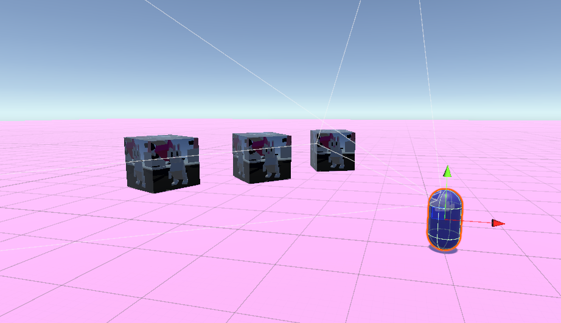
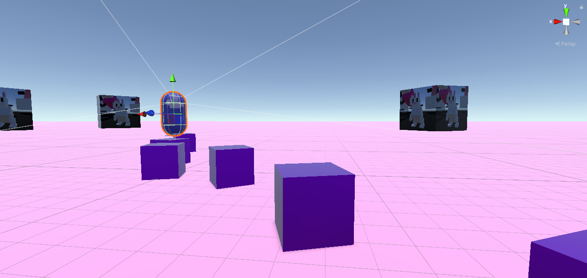

# Rini-Raycast
Testing sobre el uso de un Raycast para mecanica de juego shooter.
---
## Scripts Principales
-`MoverCamara.cs` -> Movimiento son Sensivilidad y suavidad, de la rotación de la jugadora, fluido y con perspectiva en primera persona.

-`ContolRaycasting.cs` -> Realiza rayos, que permiten detectar colisiones y sirven como generadores para instanciar prefabs como proyectiles.

---
## Objetivos
Realizar un entorno sencillo, para manejar un raycast a traves del movmiento de la cámara en primera persona, y simular un disparo, la fuerza y caída de un proyectil en el motor de fisicas integrado de unity.

-`Ray rayoo = Caramara.ViewportPointToRay(new Vector3(0.5f,0.5f,0.0f));` -> Crea un rayo desde el centro de la cámara, punto medio coordenadas 0,5 y 0,5.

-`pro = Instantiate(bala, rayoo.origin, transform.rotation);` -> Instanciamos un proyectil y le damos fuerza de impulso con `rb.AddForce(Caramara.transform.forward * 15, ForceMode.Impulse);`.

-`if (Physics.Raycast(rayoo, out hit) == true && hit.distance<5){}` -> Comprobamos si hubo un impacto almacenado en el ray, y la distancia. Util para disparos del tipo Hitscan. 

-`cuerpoJugador.transform.localRotation = Quaternion.AngleAxis(mouseMirar.x, cuerpoJugador.transform.up);` -> Rotación de la jugadora sincronizada con el movimiento de la cámara.

---
## Version jugable
[Disponible en Itch.io] https://rhifumi.itch.io/rini-raycast
---
## Video
[Disponible en Youtube] https://www.youtube.com/watch?v=5xvfQhQ_ftI
---
### Capturas

